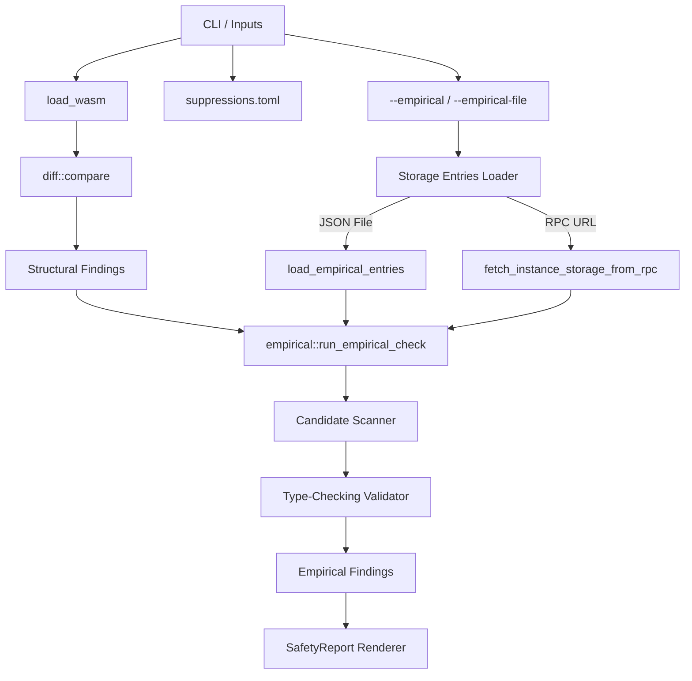

# Empirical Validation Architecture

This document describes the internal architecture of the Empirical Storage Validation Mode in `soroban-upgrade-safeguard`.

---

## 1. Subsystem Architecture

The validation mode integrates with the existing static analysis pipeline. The process flows as follows:

---

## 2. Component Reference

### 2.1 The Candidate Scanner (`find_scval_candidates`)
Because storage entries are arbitrary key-value payloads representing various datastructures, the validation engine needs to locate values corresponding to the target UDT definition. 

The `find_scval_candidates` function traverses an arbitrary XDR `ScVal` recursively:
1. It attempts to validate the current node as the target UDT.
2. If it succeeds, the value is recorded as a candidate.
3. It recursively visits sub-elements in:
   - Vectors: Traverses each element in the `ScVec`.
   - Maps: Traverses both keys and values in the `ScMap`.

This scanning strategy allows the validation engine to automatically locate and isolate instances of the UDT regardless of where it is nested (e.g. if the UDT is a value inside a Map, or an element inside a vector stored at a persistent key).

---

## 3. Graceful Degradation Design

Stellar RPC's `getLedgerEntries` endpoint does not support wildcards or scanning of all keys on the ledger. As a result, off-chain tools cannot programmatically discover all persistent storage keys associated with a contract ID.

To handle this constraint, the loader degrades gracefully:
1. **Instance Storage Verification**: It queries the contract instance ledger entry, which contains a storage vector (`storage: Option<VecM<ContractDataEntry>>`). This vector holds the contract's instance storage and can be fully enumerated.
2. **Persistent Storage Alert**: If persistent storage layout changes are structurally flagged, the loader warns the user that persistent storage cannot be programmatically enumerated over RPC, recommending the use of `--empirical-file` to supply a complete snapshot of persistent keys.
