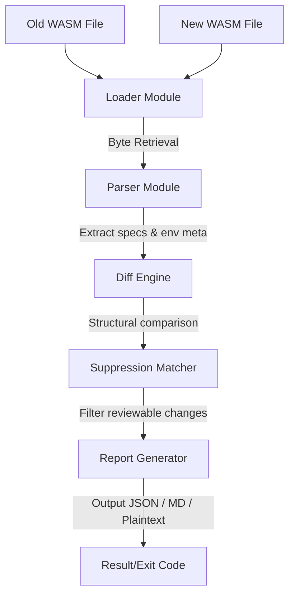

# Soroban Upgrade Safeguard: Internal Architecture & Verification Design

This document details the internal design, module dependencies, pipeline architecture, and security properties of the `soroban-upgrade-safeguard` analysis engine.

---

## 1. System Overview

`soroban-upgrade-safeguard` performs static analysis of Soroban smart contract WASM bytecode to verify upgrade compatibility. It parses and compares embedded specs, environment metadata, and storage layout schemas to guarantee that version updates do not break deployed contract interfaces.

---

## 2. Pipeline Execution Flow

The analysis lifecycle comprises four sequential stages: Loader, Parser, Diff Engine, and Report Generator.

### Stage 1: Loader (`loader.rs`)
- **Disk Resolution**: Resolves relative/absolute file paths and reads raw binary file content into memory.
- **RPC Integration**: Integrates a robust client that builds and sends JSON-RPC requests to active Stellar Core/Soroban RPC endpoints.
- **Payload Verification**: Validates structure formats to ensure correct network payloads before parsing.

### Stage 2: Parser (`parser.rs`)
- **Section Parsing**: Locates the custom contract spec sections and decodes them.
- **Duplicate Analysis**: Prevents duplicate specs from causing unexpected comparison bypasses.
- **Symbol Integrity**: Extracts environment metadata variables and checks for missing structures.

### Stage 3: Diff Engine (`diff.rs`)
- **Function diffing**: Checks for deleted, added, or modified functions. Gathers argument type mutations.
- **UDT Struct/Enum diffing**: Checks struct fields and enum cases for modifications, name changes, type overrides, or deletions.
- **Union/Error Enum diffing**: Validates custom tagged union structures and error mapping codes.
- **Cascade Detection**: Implements type dependency walking to automatically flag all dependencies of a broken type as cascading breaks.

### Stage 4: Suppression Matcher (`suppression.rs`)
- **Matching Evaluation**: Compares each finding against the list of suppressed rules.
- **Expiry Auditing**: Rejects rules that have passed their expiration threshold.
- **Fingerprint Matching**: Computes SHA-256 hashes of findings and matches them exactly against configured fingerprints.

---

## 3. Modular Responsibilities

The codebase is organized into highly focused modules:

| Module | Core Responsibility | Key Types |
| :--- | :--- | :--- |
| `loader` | Byte extraction from disk or RPC | `WasmBuild`, `fetch_wasm_from_rpc` |
| `parser` | Parsing WASM custom spec sections | `ContractEnvMeta`, `extract_metadata` |
| `spec` | AST representation of spec contents | `ContractSpec` |
| `diff` | Structural diffing algorithms | `Finding`, `Severity`, `compare` |
| `suppression` | Expiry-aware suppression configurations | `SuppressionConfig`, `SuppressionRule` |
| `report` | Aggregating diff findings with metadata | `SafetyReport`, `ReportedFinding` |
| `render` | Formatting outputs for Markdown, Text, and JSON | `RenderableReport`, `SeverityCounts` |
| `color` | Diagnostic terminal coloring | `should_disable_color` |
| `mapper` | Mapping contract specs to database storage schemas | `LayoutMapper` |
| `spec_json` | JSON serializers for contract specs | `SpecJson` |
| `error` | Centralized crate error enum | `Error` |
